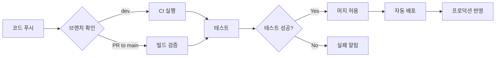

# Void - 감정 배출 및 위로 서비스 백엔드

<div align="center">


</div>


## 👥 팀원
- Frontend Developer
  [이만재](https://github.com/leemanjae02)
- Backend Developer
  [김도윤](https://github.com/dearmytwilight)
  [조윤경](https://github.com/yvngyeong)
  [정영훈](https://github.com/YH0223)


---
## 📌 프로젝트 소개

**Void**는 사용자의 고민과 감정을 듣고 AI(Gemini)가 따뜻한 위로를 전달하는 감정 배출 서비스입니다. 
개인정보 보호를 위한 NER(Named Entity Recognition) 필터링과 실시간 고민 키워드 랭킹 기능을 제공합니다.

### 🎯 주요 기능

- **AI 기반 감정 상담**: Gemini API를 활용한 맞춤형 위로 메시지 생성
- **개인정보 보호**: NER 필터링으로 민감한 개인정보 자동 마스킹
- **키워드 분석**: 사용자 고민에서 핵심 키워드 추출
- **실시간 랭킹**: Redis 기반 TOP3 고민 키워드 실시간 조회

### 🚀 프로덕션 준비 완료

> ✨ **이 프로젝트는 완전히 자동화된 CI/CD 파이프라인으로 운영됩니다.**

- ✅ AI API와 백엔드 모두 자동 배포 완료
- ✅ GitHub Actions 기반 지속적 통합/배포
- ✅ 로컬 테스트 불필요 - 프로덕션 환경에서 검증
- ✅ 시크릿 관리 자동화 (GitHub Secrets)

### 🏭 프로덕션 아키텍처

```
┌─────────────┐      ┌──────────────┐      ┌─────────────┐
│   Client    │ ---> │  Spring Boot │ ---> │   Gemini    │
│  (Frontend) │      │   Backend    │      │  AI API     │
└─────────────┘      └──────────────┘      └─────────────┘
                            │
                            ├──> ┌─────────────┐
                            │    │    Redis    │
                            │    │  (Ranking)  │
                            │    └─────────────┘
                            │
                            └──> ┌─────────────┐
                                 │  NER Filter │
                                 │   Service   │
                                 └─────────────┘
```

**인프라 특징:**
- **무중단 배포**: Blue-Green 또는 Rolling Update
- **자동 스케일링**: 트래픽에 따른 자동 확장 (선택적)
- **모니터링**: 헬스 체크 및 로그 수집 자동화

---

## 🏗️ 기술 스택

### Backend
- **Framework**: Spring Boot 3.4.2
- **Language**: Java 17
- **Build Tool**: Gradle
- **Database**: H2 (개발)
- **Cache**: Redis

### AI & External APIs
- **AI Model**: Google Gemini 2.5 Flash
- **NER Processing**: Custom AI Analysis Service

### DevOps
- **CI/CD**: GitHub Actions
- **Containerization**: Docker(NER/FastAPI)

---

## 📂 프로젝트 구조

```
void-BE-main/
├── .github/
│   ├── ISSUE_TEMPLATE/          # 이슈 템플릿
│   ├── workflows/
│   │   ├── ci.yml              # CI 파이프라인
│   │   └── deploy.yml          # 배포 파이프라인
│   └── pull_request_template.md
│
├── src/main/java/com/example/demo/
│   ├── VoidApplication.java    # 메인 애플리케이션
│   │
│   ├── core/                   # 핵심 설정 및 필터
│   │   ├── config/
│   │   │   ├── RedisConfig.java
│   │   │   ├── SwaggerConfig.java
│   │   │   ├── WebConfig.java
│   │   │   └── JacksonConfig.java
│   │   └── filter/             # 공통 필터
│   │
│   ├── domain/                 # 도메인별 비즈니스 로직 (DDD)
│   │   ├── gemini/             # Gemini AI 상담
│   │   │   ├── controller/
│   │   │   ├── service/
│   │   │   ├── dto/
│   │   │   └── exception/
│   │   │
│   │   ├── nerfilter/          # NER 개인정보 필터링
│   │   │   ├── service/
│   │   │   └── dto/
│   │   │
│   │   └── ranking/            # 키워드 랭킹
│   │       ├── controller/
│   │       └── service/
│   │
│   └── shared/                 # 공통 모듈
│       ├── exception/          # 전역 예외 처리
│       ├── response/           # 통일된 API 응답
│       └── util/               # 유틸리티
│
├── src/main/resources/
│   └── application.yaml        # 설정 파일
│
├── build.gradle                # 빌드 설정
└── README.md
```

### 아키텍처 패턴
- **DDD (Domain-Driven Design)**: 도메인별 패키지 분리
- **Layered Architecture**: Controller → Service → Repository
- **Clean Architecture**: core, domain, shared로 명확한 의존성 분리

---

## 🚀 배포 환경

> ⚠️ **중요**: 이 프로젝트는 **프로덕션 환경에서 CI/CD를 통해 자동 배포**되도록 설계되었습니다.  
> AI API와 백엔드 모두 자동화된 파이프라인으로 관리되며, **로컬 환경에서의 테스트는 제한적**입니다.

### 운영 환경 접속
- **서비스** : https://void-fe-nine.vercel.app/
- **FastAPI/Docs**: `https://jyhdevstore.store/docs`
- **BackEnd/Swagger UI**: `https://voidvoid.store/swagger-ui/index.html`

### CI/CD 파이프라인

프로젝트는 GitHub Actions를 통해 완전히 자동화되어 있습니다:

```
코드 푸시 → CI 빌드 & 테스트 → 배포 → 프로덕션 반영
```

**CI/CD Pipeline**
1. **코드 푸시** (`dev` 브랜치) → CI 파이프라인 실행
2. **Pull Request** (`main` 브랜치) → 빌드 검증 및 테스트
3. **머지 완료** → 자동 배포 트리거
4. **프로덕션 배포** → 서버 자동 업데이트


### 로컬 개발이 필요한 경우:

1. **기능 개발**
```bash
git checkout -b feature/your-feature
# 코드 수정
git commit -m "feat: your feature"
git push origin feature/your-feature
```

2. **Pull Request 생성**
- PR 생성 시 자동으로 CI 파이프라인 실행
- 빌드 성공 여부 확인

3. **코드 리뷰 및 머지**
- 리뷰 완료 후 `main` 브랜치로 머지
- 자동 배포 파이프라인 트리거

### 로컬 빌드 (선택사항)

CI에서 실패하는 경우를 방지하기 위한 로컬 빌드 검증:

```bash
# 프로젝트 클론
git clone https://github.com/GDGoC-OneWave33/void-BE.git
cd void-BE

# 빌드만 확인 (실행 불가)
./gradlew clean build

# 환경 변수 없이 컴파일 체크만
./gradlew compileJava
```

> 💡 **Tip**: 로컬에서는 빌드 검증만 수행하고, 실제 기능 테스트는 배포된 환경에서 진행하세요.

---

## 📡 API 명세

### 1. 감정 상담 API

**POST** `/ask`

사용자의 고민을 받아 AI가 위로와 키워드를 반환합니다.

**Request:**
```json
{
  "text": "오늘 해커톤 너무 힘들다."
}
```

**Response:**
```json
{
  "status": "OK",
  "code": 200,
  "message": "요청이 성공했습니다.",
  "data": {
    "answer": "해커톤 정말 고생 많으셨네요. 새로운 것을 배우고 구현하는 과정에서 막막함을 느끼셨을 것 같아요...",
    "keyword": ["해커톤", "힘듦", "스트레스"]
  }
}
```

**주요 특징:**
- 개인정보 자동 마스킹 (`*` 처리)
- 무의미한 입력 거부 (`isValid: false`)
- 키워드 자동 추출 및 랭킹 업데이트

---

### 2. 키워드 랭킹 조회 API

**GET** `/ranking/top3`

가장 많이 언급된 상위 3개 키워드를 조회합니다.

**Response:**
```json
{
  "status": "OK",
  "code": 200,
  "message": "요청이 성공했습니다.",
  "data": [
    {
      "keyword": "해커톤",
      "count": 42
    },
    {
      "keyword": "스트레스",
      "count": 38
    },
    {
      "keyword": "피곤함",
      "count": 35
    }
  ]
}
```

---

## 🔒 개인정보 보호 (NER 필터링)

### 마스킹 규칙

사용자 입력에서 다음 정보를 자동으로 마스킹합니다:

- **사람 이름**: `***` (원본 길이만큼 `*` 표시)
- **민감 정보**: 전화번호, 주소 등

### 예시

**입력:**
```
홍길동이 오늘 나한테 심하게 화를 냈어
```

**마스킹 후:**
```
***이 오늘 나한테 심하게 화를 냈어
```

### AI 응답 규칙

- 마스킹된 `*` 토큰을 절대 변경하지 않음
- "누군가", "어떤 사람" 같은 대체 표현 사용 금지
- 입력에 없는 인물을 새로 만들어내지 않음

---

## 🤖 AI 프롬프트 전략

### Gemini 시스템 프롬프트 설계

```
너는 유저의 고민을 듣고 위로해주는 상담사야.

[입력 검증]
- 거부 대상: 숫자 나열, 테스트 메시지, 스팸
- 위로 대상: 고민 표현, 감정 표현, 욕설/분노, 짧은 한숨

[위로 전략]
- 다정하고 사람다운 말투
- 무조건적인 공감과 지지
- 구체적 감정 단어 사용 (허탈함, 막막함, 억울함)
- 매번 다른 비유와 위로 사용

[개인정보 보호]
- '*' 토큰은 절대 변경 금지
- 원본 길이 유지
- 새로운 인물 추론 금지

[키워드 추출]
- 욕설 제외
- 3개 내외 (중요도 우선)
- 감정 키워드 포함 가능
```

---

## ⚙️ 설정 가이드

### application.yaml 주요 설정

```yaml
spring:
  application:
    name: void
  
  data:
    redis:
      host: localhost
      port: 6379

gemini:
  api:
    key: ${KEY_hackerton}

springdoc:
  swagger-ui:
    path: /swagger-ui.html
```

### Redis 키 구조

- **키워드 카운트**: `keyword:{keyword}` → score (카운트)
- **데이터 타입**: Sorted Set (ZSet)

---

## 🧪 테스트

### CI/CD 환경에서 자동 테스트

**GitHub Actions CI에서 모든 테스트가 자동 실행**됩니다.

### 테스트 전략

```
Unit Tests (단위 테스트)
  ↓
Integration Tests (통합 테스트 - CI Only)
  ↓
E2E Tests (프로덕션 환경)
```

### CI에서 실행되는 테스트

```bash
# GitHub Actions가 자동으로 실행
./gradlew clean build
./gradlew test
```

**테스트 항목:**
- ✅ 컨트롤러 레이어 유닛 테스트
- ✅ 서비스 로직 검증
- ✅ DTO 직렬화/역직렬화
- ✅ 예외 처리 시나리오
- ⚠️ 외부 API 호출 (Gemini) - Mock 처리

### 로컬에서 빌드만 확인

```bash
# 의존성 없이 컴파일 체크만
./gradlew compileJava

# 유닛 테스트만 실행 (외부 API 제외)
./gradlew test --tests "*.unit.*"
```

### 프로덕션 테스트

실제 기능 검증은 배포 후 프로덕션 환경에서:

```bash

# 실제 API 테스트
curl -X POST https://voidvoid.store/ask \
  -H "Content-Type: application/json" \
  -d '{"text": "테스트 메시지"}'
```

### 테스트 커버리지

- **목표 커버리지**: 80% 이상
- **실행 환경**: GitHub Actions CI
- **리포트**: Actions Artifacts에서 다운로드 가능

---

## 🔄 CI/CD 파이프라인

### 완전 자동화된 배포 시스템

이 프로젝트는 **AI API와 백엔드 모두 CI/CD가 완료**되어 수동 배포가 필요 없습니다.

### 파이프라인 구조



### GitHub Actions 워크플로우

#### 1. CI Workflow (`.github/workflows/ci.yml`)

**트리거 조건:**
- `dev` 브랜치로 푸시
- `main` 브랜치로 Pull Request

**실행 과정:**
```yaml
jobs:
  build:
    runs-on: ubuntu-latest
    steps:
      - 코드 체크아웃
      - Java 17 설정
      - Gemini API 키 주입 (GitHub Secrets)
      - Gradle 빌드 및 테스트 실행
      - 빌드 결과 검증
```

**환경 변수:**
- `KEY_hackerton`: GitHub Secrets에서 자동 주입
- 로컬 환경 변수 불필요

#### 2. Deploy Workflow (`.github/workflows/deploy.yml`)

**트리거 조건:**
- `main` 브랜치로 머지 완료

**실행 과정:**
```yaml
jobs:
  deploy:
    - 빌드 아티팩트 생성
    - 프로덕션 서버 배포
    - 헬스 체크 확인
    - 배포 완료 알림
```

### 자동화 이점

✅ **수동 배포 불필요**: 코드만 푸시하면 자동으로 배포  
✅ **환경 일관성**: 모든 배포가 동일한 파이프라인 통과  
✅ **빠른 롤백**: 문제 발생 시 이전 커밋으로 즉시 복구  
✅ **시크릿 관리**: GitHub Secrets로 안전한 API 키 관리  
✅ **테스트 자동화**: 모든 PR에 대해 자동 테스트 실행

### 배포 프로세스

1. **개발자가 코드 푸시**
```bash
git push origin feature/new-feature
```

2. **자동 CI 실행**
- 빌드 및 테스트 자동 실행
- 실패 시 슬랙/이메일 알림

3. **Pull Request 생성**
- CI 통과 확인
- 코드 리뷰

4. **main 브랜치로 머지**
- 자동 배포 트리거
- 프로덕션 환경 업데이트

5. **배포 완료**
- 서비스 중단 없이 배포 (Blue-Green 또는 Rolling Update)
- 헬스 체크 자동 확인

### 모니터링

- **배포 상태**: GitHub Actions 탭에서 실시간 확인
- **실패 알림**: 슬랙, 이메일로 즉시 알림
- **로그 확인**: Actions 로그에서 상세 디버깅 가능

---

## 🛠️ 의존성

```gradle
dependencies {
    // Spring Boot
    implementation 'org.springframework.boot:spring-boot-starter-web'
    implementation 'org.springframework.boot:spring-boot-starter-data-jpa'
    implementation 'org.springframework.boot:spring-boot-starter-data-redis'
    implementation 'org.springframework.boot:spring-boot-starter-validation'
    
    // Database
    runtimeOnly 'com.h2database:h2'
    
    // Documentation
    implementation 'org.springdoc:springdoc-openapi-starter-webmvc-ui:2.8.4'
    
    // Utilities
    compileOnly 'org.projectlombok:lombok'
    annotationProcessor 'org.projectlombok:lombok'
    
    // Test
    testImplementation 'org.springframework.boot:spring-boot-starter-test'
}
```

---

## 🐛 트러블슈팅

### 프로덕션 환경 문제 해결

#### 1. CI 빌드 실패

**증상**: GitHub Actions에서 빌드 실패

**해결 방법:**
```bash
# 로컬에서 빌드 미리 확인
./gradlew clean build

# 의존성 문제 확인
./gradlew dependencies --configuration runtimeClasspath
```

**체크리스트:**
- [ ] `build.gradle` 문법 오류 확인
- [ ] GitHub Secrets에 `KEY_hackerton` 등록 확인
- [ ] Java 17 호환성 확인

---

#### 2. Gemini API 에러

**증상**: `/ask` 엔드포인트에서 500 에러

**로그 확인:**
```bash
# GitHub Actions 로그 확인
# Actions 탭 → 최신 워크플로우 → Logs 다운로드
```

**가능한 원인:**
- ❌ API 키 만료 또는 잘못된 키
- ❌ Gemini API 할당량 초과
- ❌ 네트워크 타임아웃

**해결:**
1. [Google Cloud Console](https://console.cloud.google.com)에서 API 키 확인
2. GitHub Secrets에서 `KEY_hackerton` 업데이트
3. Gemini API 할당량 확인 및 증량 요청

---

#### 3. Redis 연결 실패

**증상**: 키워드 랭킹 조회 실패

**확인 방법:**
```bash
# 프로덕션 서버에서 Redis 연결 확인
redis-cli -h <redis-host> -p 6379 ping
# 응답: PONG

# Redis 키 확인
redis-cli -h <redis-host> KEYS keyword:*
```

**해결:**
- 프로덕션 Redis 서버 상태 확인
- `application.yaml`에서 Redis 호스트/포트 확인
- 방화벽 규칙 확인 (6379 포트 개방)

---

#### 4. 배포 후 API 응답 없음

**체크리스트:**
```bash
# 1. 서버 상태 확인
curl https://jyhdevstore.store/health

# 2. 로그 확인
# 프로덕션 서버 접속 후
tail -f /var/log/void-be/application.log

# 3. 프로세스 확인
ps aux | grep java
```

**일반적인 원인:**
- 포트 충돌 (8080 포트 사용 중)
- 환경 변수 누락
- 메모리 부족 (OOM)

---

#### 5. GitHub Actions 무한 대기

**증상**: CI 파이프라인이 계속 실행 중

**해결:**
1. Actions 탭에서 실행 중인 워크플로우 확인
2. 필요시 수동으로 Cancel
3. 워크플로우 타임아웃 설정 추가:
```yaml
jobs:
  build:
    timeout-minutes: 10  # 10분 후 자동 종료
```

---

### 로그 수집

**GitHub Actions 로그:**
```
Repository → Actions → 워크플로우 선택 → Logs 다운로드
```

**프로덕션 로그:**
```bash
# 서버 SSH 접속 후
journalctl -u void-be.service -f
```

---

### 긴급 복구

문제 발생 시 이전 버전으로 즉시 롤백:

```bash
# 1. 이전 커밋으로 되돌리기
git revert HEAD
git push origin main

# 2. 자동 재배포 트리거
# (GitHub Actions가 자동으로 처리)
```

---

## 📊 성능 최적화

- **Redis 캐싱**: 키워드 랭킹 실시간 조회
- **비동기 처리**: AI API 호출 최적화
- **연결 풀링**: RestTemplate 대신 WebClient 고려 (향후)

---

## 🤝 기여 방법

이 프로젝트는 **프로덕션 자동 배포 시스템**으로 운영되므로, 기여 시 다음 워크플로우를 따라주세요.

### 기여 워크플로우

1. **Fork & Clone**
```bash
# Repository Fork 후
git clone https://github.com/your-username/void-BE.git
cd void-BE
```

2. **브랜치 생성**
```bash
# 기능 개발
git checkout -b feature/add-new-feature

# 버그 수정
git checkout -b fix/bug-description
```

3. **로컬에서 빌드 검증**
```bash
# CI 실패 방지를 위한 사전 체크
./gradlew clean build
./gradlew test
```

4. **커밋 및 푸시**
```bash
git add .
git commit -m "feat: add new feature"
git push origin feature/add-new-feature
```

5. **Pull Request 생성**
- PR 템플릿 작성
- CI 자동 실행 대기
- 빌드 성공 확인

6. **코드 리뷰 및 머지**
- 리뷰어 승인 후 `main` 브랜치로 머지
- 자동 배포 파이프라인 트리거
- 프로덕션 반영 확인

### 커밋 컨벤션

**Conventional Commits** 스타일을 따릅니다:

```
feat: 새로운 기능 추가
fix: 버그 수정
docs: 문서 수정
style: 코드 포맷팅 (기능 변경 없음)
refactor: 코드 리팩토링
test: 테스트 추가/수정
chore: 빌드 설정, 패키지 등
```

**예시:**
```bash
git commit -m "feat: add emotional keyword filtering"
git commit -m "fix: resolve Gemini API timeout issue"
git commit -m "docs: update API documentation"
```

### 코드 스타일

- **Java**: [Google Java Style Guide](https://google.github.io/styleguide/javaguide.html)
- **Formatting**: IntelliJ IDEA 기본 포맷터 사용
- **Naming**: 
  - 클래스: PascalCase
  - 메서드/변수: camelCase
  - 상수: UPPER_SNAKE_CASE

### PR 체크리스트

PR 생성 전 다음 항목을 확인하세요:

- [ ] 로컬에서 `./gradlew build` 성공
- [ ] 관련 테스트 코드 작성
- [ ] 커밋 메시지가 컨벤션을 따름
- [ ] 코드에 주석 추가 (복잡한 로직)
- [ ] README 업데이트 (필요 시)
- [ ] API 변경 시 Swagger 문서 업데이트

### 이슈 생성

버그 리포트 또는 기능 제안:

```
Title: [BUG] Gemini API timeout on large text
Title: [FEATURE] Add emotion analysis history

내용:
- 현상/요구사항
- 재현 방법 (버그의 경우)
- 예상 동작
- 스크린샷 (선택)
```

### 주의사항


⚠️ **API 키 보안**
- `.gitignore`에 환경 변수 파일 포함 확인
- 절대 하드코딩 금지
- GitHub Secrets 사용

⚠️ **프로덕션 영향**
- `main` 브랜치로의 머지는 즉시 배포로 이어짐
- 충분한 리뷰 후 머지 권장

---

## 📝 라이선스

이 프로젝트는 MIT 라이선스를 따릅니다.


---

## 📞 문의

프로젝트 관련 문의사항은 Issue를 통해 남겨주세요.

- **GitHub Issues**: [Create Issue](https://github.com/GDGoC-OneWave33/void-BE/issues)

---

## 🎯 로드맵

### ✅ 완료된 기능

- [x] Spring Boot 3.4.2 기반 백엔드 구축
- [x] Gemini AI 통합 및 위로 메시지 생성
- [x] NER 개인정보 필터링 시스템
- [x] Redis 기반 실시간 키워드 랭킹
- [x] Swagger API 문서화
- [x] GitHub Actions CI/CD 파이프라인
- [x] 프로덕션 자동 배포 환경

### 🚧 개선 예정

**Phase 1 - 안정성 향상** (1-2개월)
- [ ] 모니터링 대시보드 (Grafana + Prometheus)
- [ ] 에러 추적 시스템 (Sentry)
- [ ] 성능 프로파일링 및 최적화

**Phase 2 - 기능 확장** 
- [ ] 감정 분석 히스토리 저장 및 조회
- [ ] 감정 분석 리포트 생성

**Phase 3 - 확장성**
- [ ] Kubernetes 오케스트레이션
- [ ] 메시지 큐 도입 (RabbitMQ / Kafka)


### 🔍 검토 중인 아이디어


- 챗봇 UI 개선 
- 키워드 감성분석 데이터 수집

---

<div align="center">

**Made with by Void Team**

</div>

